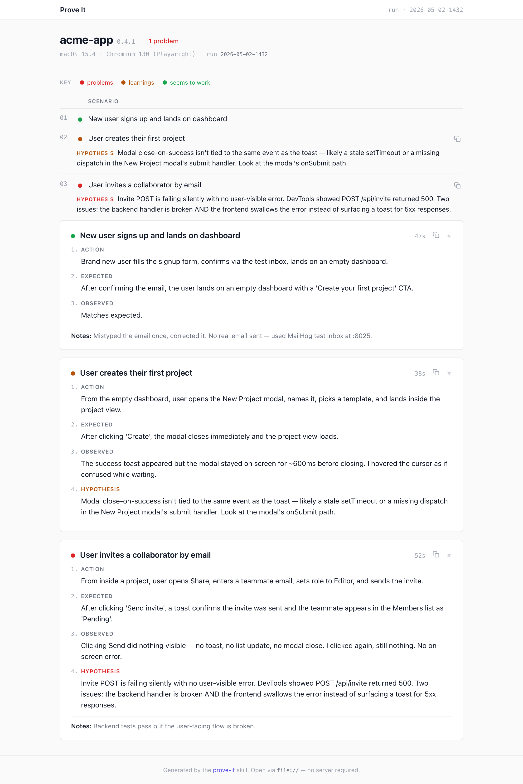

# prove-it

A Claude Code skill that proves an interactive UI works by **driving it at a human pace** through a real environment — a real browser, a real terminal, a real launchable app — and producing a self-contained static evidence site (the **Prove It** viewer) the human reviewer can open and scrub through.

> "I ran all the tests. Now let me prove a human will have the experience you expect."



## Why

Unit tests, component tests, and end-to-end suites (Playwright, Puppeteer, Videotape for BubbleTea, etc.) prove **code correctness**. They run at machine speed, in sandboxed environments, and produce pass/fail signals.

They do not tell the story of a **human** using the app. The agent that just shipped a feature has the best context to demonstrate it, but only if it does so the way a careful human would: at human pace, in a real environment, with the occasional small mistake and recovery, capturing visual evidence the user can believe.

That is what this skill is for.

## When the skill triggers

The skill is invoked when:

- The user explicitly says "prove to me that this is working", "show me it works", "demo this end to end", "verify the UX", or similar.
- The agent has just finished a significant chunk of UI / UX work and tests pass — at that point the agent should proactively offer or run this skill before declaring the task done.

It does **not** replace tests. It runs after them, on the same change.

## What it produces

A directory at `<project>/prove-it/current/` with two artifacts holding the same data:

- `metadata.json` — canonical, machine-readable. Used by the agent to look up the original experimental record when the human pastes back a permalink.
- `index.html` — the self-contained viewer. Open it in any browser via `file://`. The viewer mirrors `metadata.json` into an inline `<script>` block; no external assets, no build step.

The viewer renders the run as:

- **One overview table** at the top — every scenario as a row (`# · status ball · scenario title · copy-link icon`). Non-pass rows expose a colored **HYPOTHESIS** sub-row directly underneath.
- **Detail card per scenario**, in numbered-experiment order: `1. Action · 2. Expected · 3. Observed · 4. Hypothesis` (step 4 only for non-pass), then video, then screenshots in an in-page carousel (←/→/Esc).
- **RAG status balls** with a one-line key:
  - 🟢 *seems to work* — the human reached the goal.
  - 🟡 *learning* — the human reached the goal but hit friction worth telling someone about.
  - 🔴 *problem* — the human didn't reach the goal (broken click, silent failure, crash, capture failure).
- **Stable permalinks** on every scenario, video, and screenshot for paste-back feedback. The agent resolves a pasted permalink by reading `metadata.json` and finding the scenario by slug.

The previous two runs are kept under `<project>/prove-it/archive/<timestamp>/`. Anything older is pruned automatically. `prove-it/current/` and `prove-it/archive/` are gitignored; only `HUMAN_EVIDENCE.md` is durable across runs.

## What an experiment looks like

The agent describes each scenario as a small structured experiment in `metadata.json`. One scenario, end to end:

```json
{
  "slug": "create-first-project",
  "title": "User creates their first project",
  "status": "needs-attention",
  "narrative":  "From the empty dashboard, opens the New Project modal, names it, picks a template, and lands inside the project view.",
  "expected":   "After clicking 'Create', the modal closes immediately and the project view loads.",
  "observed":   "The success toast appeared but the modal stayed on screen for ~600ms before closing. I hovered the cursor as if confused while waiting.",
  "hypothesis": "Modal close-on-success isn't tied to the toast event — likely a stale setTimeout or a missing dispatch in the New Project modal's submit handler. Look at NewProjectModal.tsx's onSubmit.",
  "duration_seconds": 38,
  "video": "assets/create-first-project/video.webm",
  "screenshots": [
    { "file": "assets/create-first-project/01-empty.png",     "caption": "Dashboard empty state" },
    { "file": "assets/create-first-project/02-modal.png",     "caption": "New Project modal" },
    { "file": "assets/create-first-project/03-lingering.png", "caption": "Modal still visible after submit" }
  ],
  "notes": ""
}
```

The four narrative fields map directly to the numbered steps in the viewer:

1. `narrative` → **Action** — what the human-acting-agent did, in user-journey terms.
2. `expected` → **Expected** — what they expected to see.
3. `observed` → **Observed** — purely what a human saw on screen (no devtools, no source-reading inferences).
4. `hypothesis` → **Hypothesis** *(non-pass only)* — best causal guess at why, framed as speculation. The viewer renders this with a status-colored heading.

`status` is `pass` | `needs-attention` | `fail`, rendered as 🟢 *seems to work* / 🟡 *learning* / 🔴 *problem*. The test for which to assign: **did the human complete the journey?** Yes-with-friction → learning. No / wrong outcome / silent failure → problem. See [SKILL.md](SKILL.md) for the full schema.

## Install

User-level (available in every Claude Code session):

```bash
git clone https://github.com/dvhthomas/prove-it ~/.claude/skills/prove-it
```

Project-level (only in one project):

```bash
git clone https://github.com/dvhthomas/prove-it <project>/.claude/skills/prove-it
```

Restart your Claude Code session and `prove-it` will be available.

## Update

```bash
git -C ~/.claude/skills/prove-it pull
```

## Pin to a version

```bash
git -C ~/.claude/skills/prove-it fetch --tags
git -C ~/.claude/skills/prove-it checkout v0.2.0
```

Tags are listed at [github.com/dvhthomas/prove-it/tags](https://github.com/dvhthomas/prove-it/tags).

## Uninstall

```bash
rm -rf ~/.claude/skills/prove-it
```

## Files

```
prove-it/
├── README.md                          # this file
├── SKILL.md                           # the skill itself — what the agent reads
├── .claude-plugin/plugin.json         # optional plugin manifest
├── scripts/
│   └── rotate.sh                      # archive rotation (current + 2)
└── templates/
    ├── HUMAN_EVIDENCE.template.md     # starter for per-project context
    ├── metadata.example.json          # schema reference
    └── site/
        └── viewer.html                # self-contained viewer: inline CSS + inline JS renderer
```

## How the site is built

There is no build step. The agent:

1. Writes `<project>/prove-it/current/metadata.json` — the canonical record of the run.
2. Copies `templates/site/viewer.html` to `<project>/prove-it/current/index.html`.
3. Mirrors `metadata.json` into the placeholder JSON block inside the `<script type="application/json" id="metadata">…</script>` element.

That's it. No Python, no Node, no static-site generator. The viewer reads its data from the inline `<script>` block and renders client-side. Open it via `file://` in any browser.

**Why two files for the same data?** `metadata.json` is the contract that closes the paste-back loop. When the human shares a permalink like `…/index.html#invite-collaborator--shot-04` along with "I expected X, this shows Y", the agent reads `metadata.json` directly to look up the original `expected` / `observed` / `hypothesis` for that scenario — no HTML parsing required.

## License

MIT
